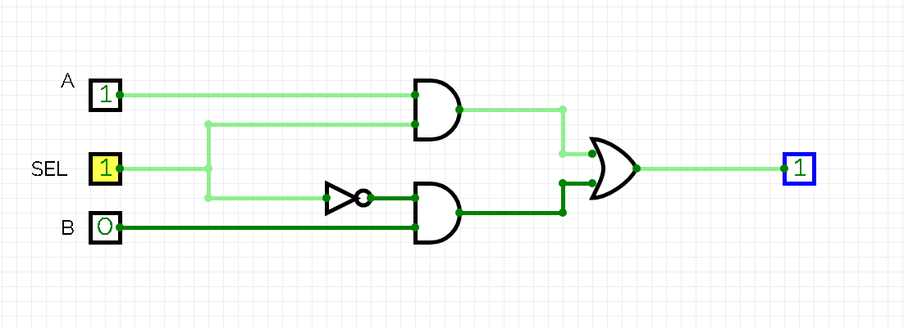

# Artix7
My project of 3bit counter in Verilog written for Artix7. In verilog we are able to work on three layers of abstraction: Gate level, Data flow level, Behavioral level. Those are three different ways of describing hardware.    
## Gate level:

${\color{green}// user-defined \space module, \space port \space order \space doesnt\space  matter}$  

module multiplex_gatelevel(A,B,SEL,X);  
input A,B,SEL;  
output X;  
  
wire not_SEL;  
wire out_and1, out_and2;  
   
${\color{green}// Verilog \space primitives \space (and, or, not), \space port \space order\space  matters, \space output \space first }$  
not not1(not_SEL,SEL);  
and and1(out_and1, SEL,A);  
and and2(out_and2, not_SEL,B);  
or or1(X, out_and1, out_and2);  
  
endmodule  
## Data flow level:  
module multiplex_gatelevel(A,B,SEL,X);  
  
input A,B,SEL;  
output X;  
assign X = (X&A)|(~X&B);  
  
endmodule
  
## Behavioral level:  procedural block  
module multiplex_gatelevel(A,B,SEL,X);  
  
input A,B,SEL;  
output X;  
always@(*) // * means code will execute anytime any signal changes  
begin  
if(SEL == 1)  
X = A;  
else  
X = B;  
end  
endmodule  
